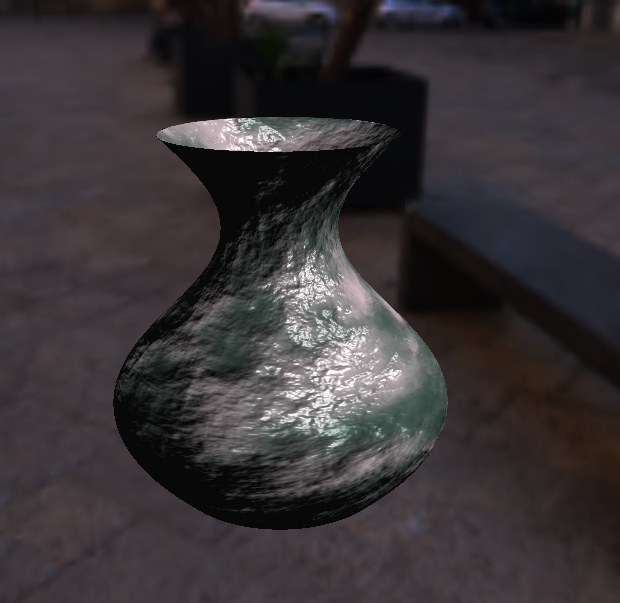

yiranGL
===============================

`yiranGL` is a personal project of learning `OpenGL`.

## Features
- [x] Written in C89 (ANSI C)
- [x] Linux
- [x] Win32
- [x] OBJ file parse
  - [x] v, vn, vt
  - [x] o / g
  - [x] mtllib
  - [x] usemtl
  - [x] normal generate
  - [x] tangent generate
  - [x] duplicate vertices remove
- [x] mtl file parse
  - [x] ka/kd/ks/Ns
  - [x] map_ka/map_kd/map_ks/map_bump/map_kn/map_disp
- [x] 3D models generate
  - [x] cube
  - [x] sphere
  - [x] torus
  - [x] teapot
  - [x] vase
- [x] shaders
  - [x] Blinn-Phong
  - [ ] PBR
  - [ ] Ray Trace
  - [ ] Path Trace
  - [x] Directional lights
  - [ ] Point lights
  - [ ] Spot lights
  - [x] Vertex Normal/Tangent Visualisation
  - [x] Wireframe on top of the shaded mesh
  - [x] Cube Map
  - [x] Normal Map
  - [x] Bump Map
  - [x] Specular Map
  - [ ] Occlusion parallax mapping
  - [ ] Shadow mapping
  - [ ] postprocessing
  - [x] Perlin-Noise Texture
  - [ ] Tessellation
- [x] Camera
  - Orbit camera
  - FPS camera
- [x] GUI rendering (using nuklear)
  - [x] Bounding Box display
  - [x] Interactive model position, scale and rotation
  - [x] Camera Speed control
  - [x] Wireframe on top surface
  - [x] Normal/Tangent display
  - [x] textures binding control
- [x] vsync 

## Dependencies

- [glad]\: OpenGL extension loader library
- [nuklear]\: Immediate mode graphical user interface
- [stb_image]\: Image loader

[//]: # "Links references"

[glad]: https://github.com/Dav1dde/glad
[nuklear]: https://github.com/vurtun/nuklear
[stb_image]: https://github.com/nothings/stb

## Screenshot

### Overview

### Obit Camera

### FPS Camera

### Noise Color and Normal Textures

