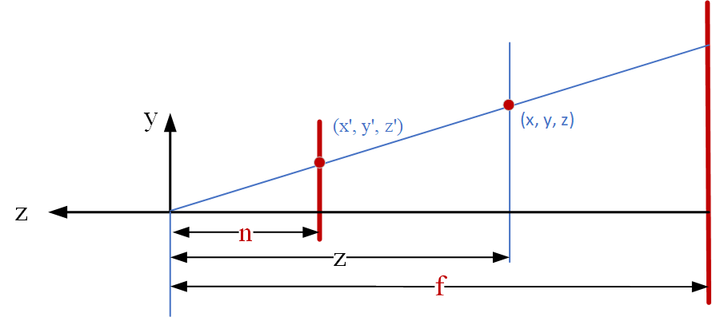
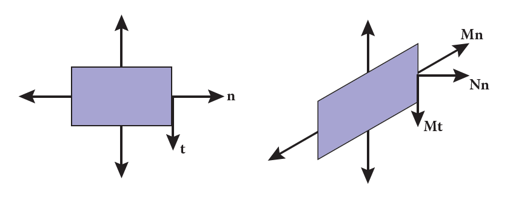
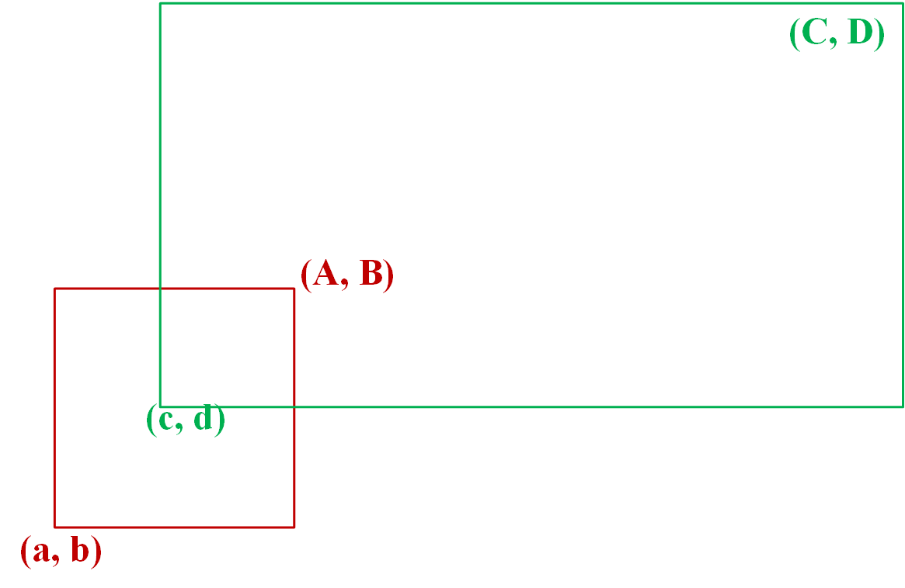

矩阵变换
=======================================

本章总结了OpenGL中常见的的一些变换。

OpenGL为左手坐标系，但是常见的数学库和三角形顶点方向都默认右手坐标系，所以推导起来可能有点绕。

我们的数学库也采用右手坐标系，矩阵排列方式为列优先，实现代码在 [mat4.c](../src/mat4.c)

## 正交投影

给定相机空间的视锥体裁剪边界的四个点，把该视锥体压缩至 [-1,1]的三围立方体内，

首先，平移该视锥体的中心至原点，然后施加缩放操作，挤压至 [-1, 1].

说明，
- t: top
- b: bottom
- r: right
- l: left
- n: near
- f: far
- 因为相机看向 `z` 轴的负方向，所以 `n` 和 `f` 均为负值.
- normalized device coordinates (NDC) 为左手坐标系，即看向的是 `+z`，缩放时要加负号.

$$
M_{ortho}=
\left[
\begin{matrix}
   {2 \over r - l} & 0 & 0 & 0 \\ 
   0 & {2 \over t - b} & 0 & 0 \\ 
   0 & 0 & \color{#F00} -{2 \over n - f}  & 0 \\
   0&0&0&1
\end{matrix}
\right]
\left[
\begin{matrix}
   1 & 0 & 0 & -{r+l \over 2} \\ 
   0 & 1 & 0 & -{t+b \over 2} \\ 
   0 & 0 & 1 & -{n+f \over 2} \\
   0&0&0&1
\end{matrix}
\right] 
=
\left[
\begin{matrix}
   {2 \over r - l} & 0 & 0  & -{r+l \over r-l} \\ 
   0 & {2 \over t - b} & 0  & -{t+b \over t-b} \\ 
   0 & 0 & \color{#F00} -{2 \over n - f}  & \color{#F00}{n+f \over n-f} \\
   0&0&0&1
\end{matrix}
\right]
$$

为了符合直觉， `openGL` 让用户输入的是非负的 `n` 和 `f`. 因此代入 `-n` 和 `-f`，

$$
\begin{equation}
M_{ortho}=
\left[
\begin{matrix}
   {2 \over r - l} & 0 & 0  & -{r+l \over r-l} \\ 
   0 & {2 \over t - b} & 0  & -{t+b \over t-b} \\ 
   0 & 0 & \color{#F00}-{2 \over f-n}  & \color{#F00}-{f+n \over f-n} \\
   0&0&0&1
\end{matrix}
\right]
\end{equation}
$$

```c++
mat4 ortho(float fov, float aspect, float n, float f) {
    float t = n * tan(RADIANS(0.5f * fov));
    float b = -t;
    float r = t * aspect;
    float l = -r;

    return mat4(
        2.f / (r - l), 0, 0, 0,
        0, 2.f / (t - b), 0, 0,
        0, 0, -2.f / (f-n), 0,
        -((r + l) / (r - l)), -((t + b) / (t - b)), -((f + n) / (f-n)), 1.f
    );
}
```

## 透视投影

寻找这样一个矩阵，对于视锥体内的坐标值，投影到 `near` 平面后对应的 `x` `y` 值.

`z` 值保持不变，从相机角度看，(x,y,z) 投射到 near 平面后，坐标值变为 (x',y',z').



根据相似三角形原理，

$$  y' = {n \over z}y  $$
$$  x' = {n \over z}x  $$
在齐次坐标内，

$$
        \begin{pmatrix}
        x \\
        y \\
        z \\
        1 \\
        \end{pmatrix}
    \Rightarrow
        \begin{pmatrix}
        nx/z\\
        ny/z \\
        ? \\
        1 \\
        \end{pmatrix}
    ==
        \begin{pmatrix}
        nx\\
        ny \\
        ? \\
        z \\
        \end{pmatrix}  
$$

所以，应该找到这样一个矩阵，左乘上该向量(x,y,z,1)后，变为(nx,ny,?,z),

$$
M_p \cdot 
        \begin{pmatrix}
        x \\
        y \\
        z \\
        1 \\
        \end{pmatrix}
    =
        \begin{pmatrix}
        nx\\
        ny \\
        ? \\
        z \\
        \end{pmatrix}  
$$

很明显，`M` 应为如下形式，

$$
M_p = 
        \begin{pmatrix}
        n&0&0&0 \\
        0&n&0&0 \\
        ?&?&?&? \\
        0&0&1&0 \\
        \end{pmatrix}
$$

近平面上的点投影后不变，远平面位于 `z` 上的点投影到 `near` 平面后坐标也不变，现在我们利用这两个特殊位置的点，代入下式，求出 `M` 矩阵的第三行，
$$
        \begin{pmatrix}
        n&0&0&0 \\
        0&n&0&0 \\
        ?&?&?&? \\
        0&0&1&0 \\
        \end{pmatrix}
        \begin{pmatrix}
        x \\
        y \\
        z \\
        1 \\
        \end{pmatrix}
    =
        \begin{pmatrix}
        nx\\
        ny \\
        ? \\
        z \\
        \end{pmatrix}  
$$

代入近平面的点 `(x,y,n)`, 坐标值不变，

$$
        \begin{pmatrix}
        n&0&0&0 \\
        0&n&0&0 \\
        ?&?&?&? \\
        0&0&1&0 \\
        \end{pmatrix}
        \begin{pmatrix}
        x \\
        y \\
        n \\
        1 \\
        \end{pmatrix}
    =
        \begin{pmatrix}
        x \\
        y \\
        n \\
        1 \\
        \end{pmatrix}
    =
        \begin{pmatrix}
        nx\\
        ny \\
        n^2 \\
        n \\
        \end{pmatrix}  
    =
        \begin{pmatrix}
        nx\\
        ny \\
        ? \\
        z \\
        \end{pmatrix}  
$$

第三行形式必然为 `(0 0 A B)`,

$$
        \begin{pmatrix}
        0 & 0 & A& B
        \end{pmatrix}  
        \begin{pmatrix}
        x\\
        y \\
        n \\
        1 \\
        \end{pmatrix}  
    = n^2
        \Rightarrow An+B=n^2
$$

同理，代入远平面上 `z` 轴的点 `(0,0,f)`,
$$
        \begin{pmatrix}
        n&0&0&0 \\
        0&n&0&0 \\
        0 & 0 & A& B  \\
        0&0&1&0 \\
        \end{pmatrix}
        \begin{pmatrix}
        0 \\
        0 \\
        f \\
        1 \\
        \end{pmatrix}
    =
        \begin{pmatrix}
        0 \\
        0 \\
        f \\
        1 \\
        \end{pmatrix}
    =
        \begin{pmatrix}
        0 \\
        0 \\
        f^2 \\
        f \\
        \end{pmatrix}  
    =
        \begin{pmatrix}
        nx\\
        ny \\
        ? \\
        z \\
        \end{pmatrix}  
    \Rightarrow Af+B=f^2
$$


可以求得，

$$
\begin{cases} 
    An+B=n^2 \\
    Af+B=f^2
 \end{cases}
\Rightarrow
\begin{cases} 
    A=n+f \\
    B = -nf
 \end{cases}
$$

$$
M_p = 
        \begin{pmatrix}
        n&0&0&0 \\
        0&n&0&0 \\
        0&0&n+f&-nf \\
        0&0&1&0 \\
        \end{pmatrix}
$$

- `openGL` 允许用户输入的是非负的 `n` 和 `f`. 因此代入 `-n` 和 `-f`，取代原来的 `n` 和 `f`，
- (1,0,0,1)和 (-1,0,0,-1)表示相同的点，对矩阵乘以`-1`相当于对最后的向量乘以 `-1`，最后使用向量坐标时一定注意除以 `w` 分量。
$$
\begin{equation}
M_p = 
        \begin{pmatrix}
        -n&0&0&0 \\
        0&-n&0&0 \\
        0&0&-n-f&-nf \\
        0&0&1&0 \\
        \end{pmatrix}
    \Longleftrightarrow
        \begin{pmatrix}
        n&0&0&0 \\
        0&n&0&0 \\
        0&0&n+f&nf \\
        0&0&-1&0 \\
        \end{pmatrix}
\end{equation}
$$

然后再乘一个正交投影矩阵(1)，把视野挤压到标准视锥，最终的投影矩阵为，

$$
\begin{equation}
\begin{split}
M_{projection} 
=& M_{ortho} \cdot M_p \\
=&
\begin{pmatrix}
   {2 \over r - l} & 0 & 0  & -{r+l \over r-l} \\ 
   0 & {2 \over t - b} & 0  & -{t+b \over t-b} \\ 
   0 & 0 & \color{#F00}-{2 \over f-n}  & \color{#F00}-{f+n \over f-n} \\
   0&0&0&1
\end{pmatrix}
\begin{pmatrix}
        n&0&0&0 \\
        0&n&0&0 \\
        0&0&n+f&nf \\
        0&0&-1&0 \\
        \end{pmatrix} \\
=&
\begin{pmatrix}
   {2n \over r - l} & 0 & {r+l \over r-l}  & 0 \\ 
   0 & {2n \over t - b} & {t+b \over t-b}  & 0 \\ 
   0 & 0 & -{f+n \over f-n}  & -{2nf \over f-n} \\
   0&0&-1&0
\end{pmatrix}
\end{split}
\end{equation}
$$

```c
mat4 perspective(float fov, float aspect, float n, float f) {
    mat4 ret;
    float t = n * tan(RADIANS(0.5f * fov));
    float b = -t;
    float r = t * aspect;
    float l = -r;
    ret.col[0] = build_vec4(2*n/(r-l), 0.f, 0.f,  0.f);
    ret.col[1] = build_vec4(0.f,2*n/(t-b), 0.f,  0.f);
    ret.col[2] = build_vec4((r+l)/(r-l), (t+b)/(t-b),-(f+n)/(f-n), -1.f);
    ret.col[3] = build_vec4(0.f, 0.f,-2*n*f/(f-n),  0.f);
    return ret;
}
```

## 法线矩阵

我们通常在相机空间进行着色，着色前需要把顶点的位置、法线和切线变换到到相机空间。

如果用矩阵 `M` (通常为 `Model` · `View`) 对表面上的点做变换, 那么 `M` 乘以表面切向量 `t` 的结果与变换后的表面仍然相切，用 `M` 变换法相 `n` 的结果可能不再与表面垂直，如下图，




为了得到变换后正确的法线，现在我们构造这样一个矩阵 `N` , 使得变换后的法线 `Nn` 和切线 `Mt` 仍然垂直.

变换之前，法向量 `n` 和切向量 `t` 垂直，点积为0,

$$ n^T·t=0 $$

把单位矩阵插入其中，带入 `M` 和它的逆，

$$  n^T·t = n^T·It = n^TM^{-1}M t = (n^TM^{-1}) \cdot (Mt) = 0 $$   

变换后的法线 `Nn` 和切向量 `Mt` 的点积也应为0，

$$ (Nn)^T \cdot (Mt) = (n^TN^T) \cdot (Mt) = 0 $$

比较上面两个等式，
$$  (n^TN^T) = (n^TM^{-1})   $$

去掉 `n`,

$$  N^T = M^{-1}   $$

则，

$$ N = (M^{-1})^T$$

这个 `N` 就是法线矩阵, 也就是 `M` 逆矩阵的转置矩阵.

给定模型变换矩阵 `model` , 视图变换矩阵 `view` , 求取法线矩阵，代码如下，

```c++
mat4 NormalMatrix = transpose(inverse(view * model);
```


## 窗口变换

将红色矩形 [a,b-A,B] 变换到青色矩形 [c,d-C,D] ,



拆分成三个步骤：
- 红色矩形把点(a, b)移动到原点.
- 缩放红色矩形，使之和青色矩形一般大小.
- 原点移动到 (c, d) .

$$
\begin{equation}
\begin{split}
window=&
\left[
\begin{matrix}
   1 & 0 & c \\ 
   0 & 1 & d \\ 
   0 & 0 & 1\\
\end{matrix}
\right]
\left[
\begin{matrix}
   {C - c \over {A-a}} & 0 & 0  \\ 
   0 & {D - d \over {B-b}}  & 0  \\ 
   0 & 0 & 1  \\
\end{matrix}
\right] 
\left[
\begin{matrix}
   1 & 0 & -a  \\ 
   0 & 1 & -b  \\ 
   0 & 0 & 1  \\
\end{matrix}
\right] \\
 =&
\left[
\begin{matrix}
   {C - c \over {A-a}} & 0 & {cA - Ca \over {A-a}}  \\ 
   0 & {D - d \over {B-b}}  & {dB - Db \over {B-b}}  \\ 
   0 & 0 & 1  \\
\end{matrix}
\right]
\end{split}
\end{equation}
$$

`MVP` 把空间变换到正方形[-1, 1]的标准视锥体，现在我们把它变换到屏幕空间。

坐标从像素中心有0.5个单位的过冲，最小像素坐标为(0,0)，一个 `width` x `height` 的屏幕具有证书个像素中心，其边界定义为 `[-0.5, width-0.5]` x `[-0.5, height-0.5]`.

代入上述矩阵，求屏幕空间的像素坐标,

$$
\begin{equation}
\begin{split}
\left[
\begin{matrix}
   x_{pixel} \\ 
   y_{pixel} \\ 
   1 \\
\end{matrix}
\right]
  =
\left[
\begin{matrix}
   {width \over 2} & 0 & {width -1} \over 2  \\ 
   0 & {height \over 2}  & {height -1} \over 2  \\ 
   0 & 0 & 1  \\

\end{matrix}
\right] 
\left[
\begin{matrix}
   x_{canonical} \\ 
   y_{canonical} \\ 
   1\\

\end{matrix}
\right] \\
\end{split}
\end{equation}
$$

```c++
float w2 = width / 2.0f;
float h2 = height / 2.0f;
mat4 ViewportMatrix = mat4(vec4(w2,0.0f,0.0f,0.0f),
                           vec4(0.0f,h2,0.0f,0.0f),
                           vec4(0.0f,0.0f,1.0f,0.0f),
                           vec4(w2-0.5, h2-0.5, 0.0f, 1.0f));
```


## 插值矫正

在求取中心坐标时，我们用的是屏幕空间，计算的是2D平面的重心坐标，忽略了z。

投影矩阵的最后一行一般表示投影轴与投影面的交点。

裁剪空间的 `w` 分量表示 顶点坐标与 轴 的 点乘。

一般情况下，投影矩阵的最后一行为 `(0, 0, -1, 0)`，所以 `w_clip = - z_eye`，


计算`z-buffer` 时用重心坐标，不用矫正过的

